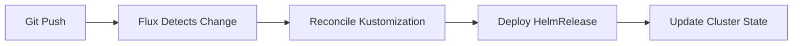

<div align="center">


# Home Operations

*Infrastructure as Code for my home Kubernetes clusters*

[](https://www.talos.dev/)
[](https://kubernetes.io/)
[](https://fluxcd.io/)
[](https://github.com/renovatebot/renovate)

[](https://github.com/pre-commit/pre-commit)
[](https://github.com/rtrox/home-ops/actions/workflows/on-pr.yaml)

</div>

---

## Overview

This repository contains the Infrastructure as Code (IaC) for my home Kubernetes clusters, managed using GitOps principles with [Flux](https://fluxcd.io/). The infrastructure runs on [Talos Linux](https://www.talos.dev/), a modern OS designed specifically for Kubernetes.

---

## Kubernetes

### Clusters

I run two Kubernetes clusters:

- **Chongus** (Primary) - Dell R730 servers with NVIDIA GPUs
- **Bitty** (Secondary) - Intel NUC cluster

### Core Components

- [cilium](https://cilium.io/) - eBPF-based CNI with native routing and Gateway API support
- [cert-manager](https://cert-manager.io/) - Automated TLS certificate management
- [external-dns](https://github.com/kubernetes-sigs/external-dns) - Automatic DNS management via Cloudflare
- [external-secrets](https://external-secrets.io/) - Kubernetes External Secrets Operator integrated with Doppler
- [envoy-gateway](https://gateway.envoyproxy.io/) - Gateway API implementation for HTTP routing
- [rook-ceph](https://rook.io/) - Distributed storage with Ceph
- [volsync](https://volsync.readthedocs.io/) - PVC backup and restore to B2 and MinIO
- [cloudnative-pg](https://cloudnative-pg.io/) - PostgreSQL operator with HA and backup

### GitOps

[Flux](https://fluxcd.io/) watches the `cluster-apps/` directory and reconciles the cluster state automatically. The workflow:



### Directory Structure

This repository follows a structured GitOps layout:

```text
📁 cluster-apps/           # Application definitions (Flux source)
├── 📁 base/              # Shared applications across clusters
├── 📁 chongus/           # Chongus cluster applications (NEW PATTERN)
│   └── 📁 [namespace]/
│       └── 📁 [app]/
│           ├── 📁 app/   # HelmRelease + configs
│           └── ks.yaml   # Flux Kustomization
├── 📁 bitty/             # Bitty cluster (deprecated pattern)
└── 📁 components/        # Reusable Kustomize components

📁 clusters/              # Cluster bootstrap configurations
├── 📁 chongus/
│   ├── 📁 bootstrap/     # Helmfile-based bootstrap
│   ├── 📁 flux/          # Flux Kustomizations
│   └── 📁 talos/         # Talos configuration
└── 📁 bitty/

📁 .taskfiles/            # Operational automation
```

### Workflow

### Network Architecture

**Container Networking:**

- Cilium CNI with eBPF
- Native routing mode (10.244.0.0/16)
- KubeProxy replacement enabled
- Hubble for observability

**Gateway API:**

- `envoy-external` (172.22.12.2) - Internet-accessible via Cloudflare Tunnel
- `envoy-internal` (172.22.12.1) - Local network only (Tailscale)

**Load Balancing:**

- Cilium LBIPAM (172.22.12.0/24)
- Maglev algorithm with DSR mode

**DNS:**

- External-DNS with Cloudflare provider
- Automatic record creation from Gateway API HTTPRoutes

**Certificates:**

- Let's Encrypt via cert-manager
- Automatic TLS for all HTTPRoutes

---

## ☁️ Cloud Dependencies

While most infrastructure runs on-premises, some cloud services are used:

| Service                                                       | Purpose              | Cost                   |
| ------------------------------------------------------------- | -------------------- | ---------------------- |
| [Cloudflare](https://www.cloudflare.com/)                     | DNS, Tunnel, CDN     | ~$0/month (free tier)  |
| [Doppler](https://www.doppler.com/)                           | Secret management    | ~$0/month (free tier)  |
| [Backblaze B2](https://www.backblaze.com/b2/cloud-storage.html) | Backup storage       | ~$5/month              |
| [GitHub](https://github.com/)                                 | Git hosting, CI/CD   | ~$0/month (free tier)  |

---

## 🔧 Hardware

### Chongus Cluster (Primary)

| Device       | CPU        | RAM    | Storage                | Purpose                           |
| ------------ | ---------- | ------ | ---------------------- | --------------------------------- |
| Dell R730 x3 | Intel Xeon | 256GB+ | 2x Samsung 870 EVO 2TB | Kubernetes nodes with NVIDIA GPUs |

**Storage:**

- Rook-Ceph: 6x 2TB SSDs (2 per node)
- Storage Class: `ceph-block` (default)
- Replication: 3 replicas

### Bitty Cluster (Secondary)

| Device       | CPU         | RAM   | Storage | Purpose                        |
| ------------ | ----------- | ----- | ------- | ------------------------------ |
| Intel NUC x3 | Intel i5/i7 | 32GB+ | NVMe    | Kubernetes nodes with QuickSync |

- Rook-Ceph: 3x 512GB SSDs (1 per node)
- Storage Class: `ceph-block` (default)
- Replication: 3 replicas

### Supporting Infrastructure

| Device       | Purpose                                       |
| ------------ | --------------------------------------------- |
| True NAS     | NFS storage for media and shared files        |
| Raspberry Pi | Ansible-managed DNS, Tailscale, and mDNS repeater |

---

## Getting Started

### Prerequisites

Tools are managed via [mise](https://mise.jdx.dev/):

```bash
# Install mise
curl https://mise.run | sh

# Install all tools
mise install
```

### Bootstrap a New Cluster

```bash
# 1. Generate Talos configuration
task talos:generate-clusterconfig

# 2. Apply to nodes
task talos:apply-clusterconfig

# 3. Bootstrap cluster
task k8s-bootstrap:talos-cluster

# 4. Deploy core apps and CRDs
task k8s-bootstrap:apps
```

Flux will then automatically sync applications from `cluster-apps/`.

### Common Operations

```bash
# Validate Flux resources locally
task flux:validate

# Force reconcile an application
flux reconcile helmrelease [app-name] -n [namespace]

# Check cluster status
kubectl get kustomization -A
kubectl get helmrelease -A

# View Ceph storage health
kubectl -n rook-ceph exec -it deploy/rook-ceph-tools -- ceph status
```

---

## Documentation

For detailed information about the repository structure, patterns, and best practices, see:

**[CLAUDE.md](CLAUDE.md)** - Comprehensive architectural context and patterns

---

## Acknowledgments

This repository is inspired by the [k8s-at-home](https://github.com/onedr0p/home-ops) community and draws patterns from:

- [onedr0p/home-ops](https://github.com/onedr0p/home-ops) - Excellent reference implementation
- [k8s-at-home](https://discord.gg/k8s-at-home) - Amazing community and support
- [kubesearch.dev](https://kubesearch.dev/) - Discovery of Helm charts and deployment examples

Special thanks to the maintainers of all the open-source projects used in this cluster.
